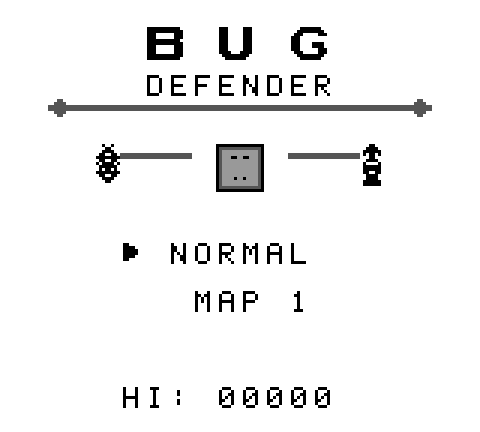

<div align="center">

# 🐛 Bug Defender

**A monochrome Game Boy tower-defense game where you defend a desktop computer from waves of robot agents and rogue AI bugs.**

[](https://github.com/sinedied/gb-bug-defense/actions/workflows/deploy.yml)
[](https://sinedied.github.io/gb-bug-defense/)
[-306230?style=flat-square)](#)
[](https://github.com/gbdk-2020/gbdk-2020)

[**▶ Play in your browser**](https://sinedied.github.io/gb-bug-defense/) · [Build it](#build--play-locally) · [How it plays](#how-it-plays) · [Project layout](#project-layout)



</div>

---

## Overview

Bug Defender compiles to a real `.gb` ROM (64 KB, MBC1+RAM+BATT) that runs on
any DMG emulator or original hardware via flashcart. SRAM-backed high
scores persist across power cycles, the soundtrack uses all four APU
channels with proper SFX arbitration, and the whole thing fits inside the
160×144 / 4-shade constraints of the 1989 platform.

> [!TIP]
> Don't have a Game Boy handy? **[Play it in your browser →](https://sinedied.github.io/gb-bug-defense/)**
> The web build bundles the game inside a CSS-drawn DMG shell using the [binjgb](https://github.com/binji/binjgb) WebAssembly emulator.

## Features

- **Two upgradeable tower types** — Antivirus (fast/cheap) and Firewall (slow/heavy), plus an EMP stunner
- **3 maps × 3 difficulty levels** with a persistent high-score table per slot
- **10 escalating waves** culminating in a 28-enemy boss mix
- **Animated everything** — pulsing computer, marching enemies, idle tower LEDs
- **Range preview** when placing or selecting a tower
- **Pause / unpause** with anywhere-on-screen overlay
- **Original chiptune soundtrack** (3 songs + boot chime + SFX on ch1/2/4)
- **MBC1 cart with battery-backed SRAM** for save data
- **Runs at 60 fps** with strict per-frame BG-write budgeting (≤ 16 writes)

## Play in browser

[**sinedied.github.io/gb-bug-defense**](https://sinedied.github.io/gb-bug-defense/)

The web build is auto-deployed from `main` via GitHub Actions on every push.

| Action  | Keyboard   |
|---------|------------|
| D-pad   | Arrow keys |
| A       | Z          |
| B       | X          |
| Start   | Enter      |
| Select  | Backspace  |

## Build & play locally

### Prerequisites (macOS)

```sh
brew install just mgba
# Apple Silicon only — GBDK ships x86_64 binaries; needs Rosetta 2:
softwareupdate --install-rosetta --agree-to-license
```

### Run it

```sh
just setup     # one-time: downloads GBDK-2020 (4.2.0) into vendor/gbdk/
just run       # build + launch mGBA on the ROM
```

### Recipes

| Recipe            | Purpose                                                  |
|-------------------|----------------------------------------------------------|
| `just build`      | Compile sources → `build/bugdefender.gb`                 |
| `just check`      | Validate ROM size, cart type, RAM/ROM bytes, header CRC  |
| `just test`       | Run host-side unit tests (math, audio, modal, anim, …)   |
| `just run`        | Build + launch mGBA                                      |
| `just emulator`   | Launch mGBA on existing ROM (no rebuild)                 |
| `just assets`     | Regenerate `res/assets.{c,h}` (Python pipeline)          |
| `just export-web` | Build ROM + bundle a playable web page in `web/`         |
| `just serve-web`  | Serve `web/` on `http://localhost:8080` for testing      |
| `just clean`      | Remove `build/` and `web/`                               |
| `just clean-all`  | Also remove `vendor/gbdk/`                               |

### Test the web build locally

```sh
just export-web    # produces web/ with binjgb + ROM + DMG shell
just serve-web     # serves http://localhost:8080
```

> [!IMPORTANT]
> binjgb fetches the ROM via `fetch()`, so opening `index.html` directly
> as a `file://` URL won't work — always use a local server.

## Controls

- **D-pad** — move placement cursor (12-frame initial / 6-frame auto-repeat)
- **A** — place selected tower (or open upgrade/sell menu on an existing tower)
- **B** — cycle tower type (Antivirus ↔ Firewall ↔ EMP)
- **Start** — begin game / open pause overlay / return to title from game over
- **Select** — cycle map / difficulty on the title screen

In the upgrade/sell menu: **D-pad up/down** picks Upgrade or Sell,
**A** confirms, **B** cancels. Gameplay freezes while any modal is open.

## How it plays

You start with **5 HP** and **30 energy**, plus a slow passive trickle of
+1 energy every 3 s. Three tower types defend your computer:

- **Antivirus** (`A`, 10 E, 3-tile range) — fast, low-damage chip-shots.
- **Firewall** (`F`, 15 E, 5-tile range) — slow but heavy hitter; the answer to robots.
- **EMP** (`E`) — area-stun pulse; cooldown-gated, no direct damage.

Each tower can be upgraded once (faster + harder hits) or sold for
half of what you've sunk into it. Killing a bug awards 3 energy; a
robot awards 5. Survive 10 escalating waves (mix of bugs and robots,
final wave is a 28-enemy boss mix) without letting HP hit zero.

- Win → **`SYSTEM CLEAN :)`**
- Lose → **`KERNEL PANIC X_X`**

## Audio

A short **boot chime** plays the moment the ROM starts — if you don't
hear it, the issue is on the emulator/host side, not in the ROM.

> [!NOTE]
> On macOS, Homebrew's `mgba` package ships only the Qt frontend. Qt
> mGBA can boot with audio effectively muted. `just run` works around
> this by passing `-C mute=0 -C volume=0x100` on the command line. If
> you launch the app any other way and hear nothing, check **Audio →
> Mute**, **Tools → Settings → Audio**, and your macOS system volume.

## Project layout

```
src/        C99 sources, one module per concern
res/        Generated tile + tilemap data (committed)
tools/      Python helpers (asset generator, web export)
specs/      Design + implementation specs (per iteration)
memory/     Decisions + conventions
qa/         QA reports per iteration
tests/      Host-side regression tests (gcc, no GBDK)
.github/    GitHub Actions workflows + agent skills
```

See [specs/mvp.md](specs/mvp.md) for the original implementation spec
and [specs/roadmap.md](specs/roadmap.md) for the iteration history.

## Tech stack

- **[GBDK-2020](https://github.com/gbdk-2020/gbdk-2020)** 4.2.0 — SDCC-based C toolchain for DMG/CGB
- **[hUGEDriver](https://github.com/SuperDisk/hUGEDriver)** — music playback (4-channel APU)
- **[just](https://github.com/casey/just)** — task runner
- **[mGBA](https://mgba.io/)** — desktop emulator
- **[binjgb](https://github.com/binji/binjgb)** — WebAssembly emulator for the web build
- **[PyBoy](https://github.com/Baekalfen/PyBoy)** — screenshot capture & e2e testing

## Deployment

The web build is deployed to GitHub Pages by
[`.github/workflows/deploy.yml`](.github/workflows/deploy.yml) on every push
to `main`. The workflow:

1. Sets up Python + `just` on `ubuntu-latest`
2. Caches `vendor/gbdk/` between runs
3. Runs `just build`, `just test`, `just check`
4. Runs `just export-web` to produce `web/`
5. Uploads `web/` as a Pages artifact and deploys it

To enable on a fork: **Settings → Pages → Source → GitHub Actions**.
